# Dashboard Template Guidance Document

[__1\. Introduction__ ](#1-introduction)  
[__2\. Desktop Scaling Issues \(Tableau Desktop Only\)__ ](#2-desktop-scaling-issues-tableau-desktop-only)  
[__3\. How to use Templates \(Tableau Desktop Only\)__](#3-how-to-use-templates-tableau-desktop-only)

- [Downloading and using templates](#downloading-and-using-templates)
- [Custom Colour Palettes](#custom-colour-palettes)
- [Custom Colours](#custom-colours)

[__4\. Text Formatting__](#4-text-formatting)

- [Text Styling](#text-styling)
- [Text Colours](#text-colours)

[__5\. Dashboard Sizing__](#5-dashboard-sizing)

- [Page Width and Height](#page-width-and-height)
- [Tablet / Mobile Designs](#tablet-mobile-designs)

[__6\. Charts__](#6-charts)

- [Chart Colours](#chart-colours)
- [Chart Tooltips](#chart-tooltips)
- [Text Alignment](#text-alignment)
- [Chart Dividers](#chart-dividers)

[__7\. Maps__](#7-maps)

- [Map Colours](#map-colours)
- [Map Labels](#map-labels)
- [Filters and Reset Map](#filters-and-reset-map)

[__8\. Header Design__](#8-header-design)

- [NHS Logo](#nhs-logo)
- [Title, Description and Latest Release](#title-description-and-latest-release)
- [Date Last Refreshed](#date-last-refreshed)

[__9\. Buttons__](#9-buttons)

[__10\. Tables__](#10-tables)

[__11\. Filters__](#11-filters)

[__12\. Icons__](#12-icons)

[__13\. General Padding and Formatting of Objects__](#13-general-padding-and-formatting-of-objects)

- [NHS Digital Header](#nhs-digital-header)
- [Headlines](#headlines)
- [Filter Bar](#filter-bar)
- [Navigation Buttons](#navigation-buttons)
- [Charts](#charts)
- [Maps](#maps)
- [Text Page](#text-page)

[__14\. Accessibility__](#14-accessibility)

[__15\. What Chart Should Be Used When?__](#15-what-chart-should-be-used-when)

- [Bar Charts](#bar-charts)
- [Gauge / Donut Charts](#gauge-donut-charts)
- [Line Charts](#line-charts)

# ____1\. Introduction____
The purpose of this document is to provide supporting guidance for the style and formatting of NHS Digital dashboards plus to provide links to a set of template Tableau workbooks which have been created in line with the guidance provided\. The aim of these templates is to save development time per dashboard, share good practice and increase consistency of look and feel across NHS Digital dashboards\. Although this guide is written with examples from Tableau, most of all these ideas and principles can be used on other visualisation software including Microsoft PowerBI\.   

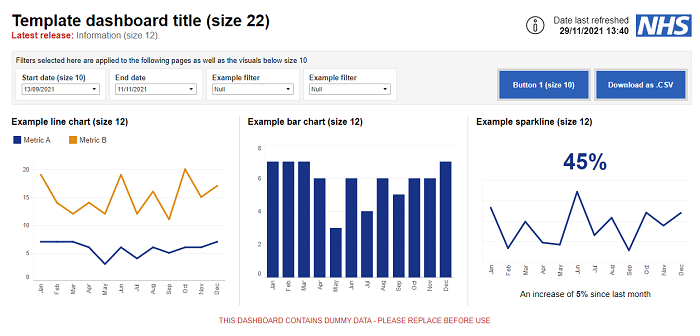
<figcaption>Figure 1 - Tableau Template Screenshots</figcaption>
 

# ____2\. Desktop Scaling Issues \(Tableau Desktop Only\)____

To ensure the dimensions in this guidance document are accurately reflected in Tableau Desktop you must make sure your default screen is set to 100% scale\.   
When Tableau Desktop is opened it uses 1:1 sizing which means if the system scaling is at 100% then any visualisation in Tableau Desktop will be accurately reflected in Tableau Server when the workbook is published\. If the system scaling is not 100% then there can be visual discrepancies between both\.   
Here are the instructions to ensure your Tableau Desktop is scaling correctly:

1. Right click your desktop and click Display Settings
2. Select your main display
3. Scroll down to Scale and Layout and change this to 100%
4. If your previous scale was higher than 100% then everything will look a lot smaller\.
5. Open up the Tableau Workbook
6. Once this is open you can change your scaling to the previous sizing during this work session\. If you need to reopen a workbook repeat the above steps

There is also a video recording of how to do this [here](https://hscic365-my.sharepoint.com/:v:/g/personal/daha24_hscic_gov_uk/ESJ6oE1xE45CjoUW1F1qJ2wBmPXRlbr0MmX2jDW5HwWTVQ)\.  

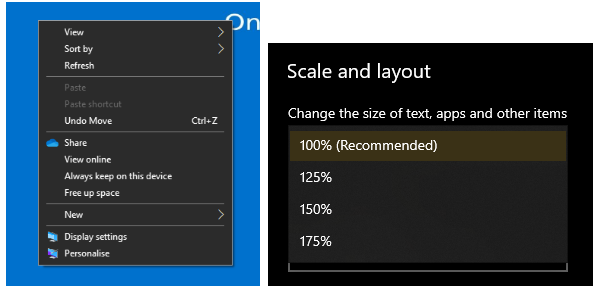
<figcaption>Figure 2 - Setting screenshots</figcaption>
 

# ____3\. How to use Templates \(Tableau Desktop Only\)____

Ensure you have read section 2 above before commencing and familiarise yourselves with the populated templates [here](./files/NHSD_Templates_Complete_v9.twbx)\.

#### Downloading and using templates

Download the blank templates from [here](./files/NHSD_Templates_Empty_v9.twbx) and follow either Option 1 or Option 2 depending on your use case\.   
__Option 1__ \- recommended if starting a new dashboard

- Replace the dummy data source with new data source
- Update the i1,i2 and i3 worksheets by 
	- Replacing the SUM\(A\) in the Rows with another arbitrary measure\.
	- Right clicking on this measure and change to "Discrete"
	- Ensuring you hide the headers
	- Remember to update the tooltip with relevant text and duplicate the information icons for any additional tooltips on the pages\.
	- Note if the "I"s don't appear correctly head to Section 12: Information Icons
- Add own visuals to dashboards in place of the dummy placeholders

  
__Option 2__ \- recommended if building on existing dashboard

- Copy and paste individual tabs from the template into your existing dashboard and use this to help update your existing dashboard

  
Contact David Hardy \([David\.Hardy5@nhs\.net](mailto:David.Hardy5@nhs.net)\) for any further advice

#### Custom Colour Palettes

Having the NHS Digital default colours for charts can save time and this can be achieved by having the colour palette installed in 'My Tableau Repository' on your system:

- Download this custom "Preferences\.tps" from [here](./files/Preferences.tps)\.
- Replace your "Preferences\.tps" file in your 'My Tableau Repository' which can be found by clicking File > Repository Location
- The NHS Digital Colour Palette should now appear when using a discrete dimension such as regions

#### Custom Colours

This method shows how to save colours used often in the dashboard to avoid having to add the hex code each time

- Select any object on a dashboard or sheet
- Select something to colour such as the background
- Head to more colours
- Select a blank box in the custom colours and paste in the following key colours
- Grey \(\#666666\)
- Emergency Services Red \(\#DA291C\)
- NHS Blue \(\#005EB8\)
- Secondary/Highlight colour: NHS Orange \(\#ED8B00\)
- Background Colour behind filters and other objects: Grey \(\#f5f5f5\)

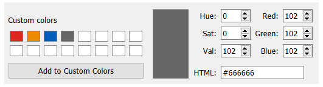
 

# ____4\. Text Formatting____

Text formatting across the dashboard should be consistent\. Smaller font sizes can cause accessibility issues\. The standard font used is Arial and a variety of sizes are used depending on the feature of the dashboard\.

#### Text Styling

- Font: Arial
- Headings: Size: 12pt , Type: Bold, Colour: Black
- Headings Description, Size 11pt, Type: Standard, Colour: Black
- Sub Headings: Size: 11pt, Type: Bold, Colour: Black
- General Text, Size: 11pt, Type: Standard, Colour: Black
- Tables Headings, Size 10pt, Type Bold, Colour: Black
- Tables, Size 10pt, Type Standard, Colour: Black

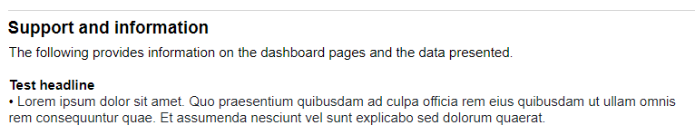
<figcaption>Figure 3 - Heading, sub heading and general text example</figcaption>
 

#### Text Colours

- Primary colour: Black
- Secondary colour: Grey \(\#666666\)
- Highlight colour: Emergency Services Red \(\#DA291C\)

Be aware using green/red together as these are not suitable for those who are colour blind\. See [NHS guidance](https://www.england.nhs.uk/nhsidentity/identity-guidelines/colours/) for more information on colours\.   
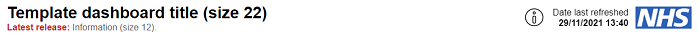
<figcaption>Figure 4 - Header example using Primary, Secondary and Highlight Colours</figcaption>
 

# ____5\. Dashboard Sizing____

Dashboard sizing is important to ensure all users see the same layout of the dashboard as designed\. This guidance document has been written with a focus on Desktop views only\. Tablet and Mobile templates for web dashboards will be updated at a future

#### Page Width and Height

- Use "Fixed Size" to ensure page looks the same across all devices\. This also has performance benefits vs "Automatic"\.
- Width fixed to 1,262px, this allows users of the majority of popular screen sizes to see the full width of a dashboard without horizontal scrolling
- Height is variable depending on your dashboard templates provided have a standard height of 1400px\. Note when you adjust the height the height of objects on the page may change so you will need to update these manually afterwards\.

  
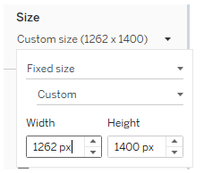
<figcaption>Figure 5 - Screenshot of page width settings</figcaption>
 

#### Tablet / Mobile Designs

Details on tablet and mobile designs to be provided in a future revision of this document\.

# ____6\. Charts____

Charts are often used in dashboards to convey information to the user, it is important the colours are consistent across the dashboard as to not confuse the user\.

#### Chart Colours

- Primary colour: Chart Blue 1 \(\#003087\)
- Secondary/Highlight colour: NHS Orange \(\#ED8B00\)
- Background Colour behind filters and other objects: Grey \(\#f5f5f5\)
- Tertiary\+ Colours: Choose from [NHS Guidance](https://www.england.nhs.uk/nhsidentity/identity-guidelines/colours/)

  
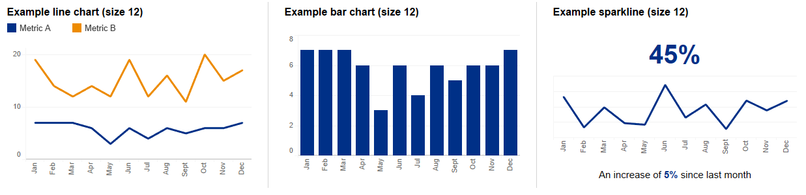
<figcaption>Figure 6 - Example charts with primary colour and highlight colour</figcaption>
 
 
  
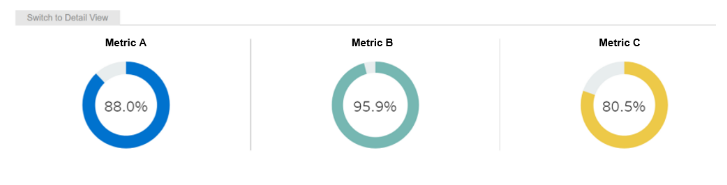
<figcaption>Figure 7 - Example charts with additional colours</figcaption>
 
 

  
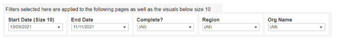
<figcaption>Figure 8 - Example of the background grey behind filters</figcaption>
 

#### Chart Tooltips

Tooltips provide additional information to the user when they highlight areas of a chart

- Tooltips for charts should be Font Size: 10
- Descriptions colour: \#787878 Font Type: Standard
- Metrics Colour: Black and Font Type: Bold

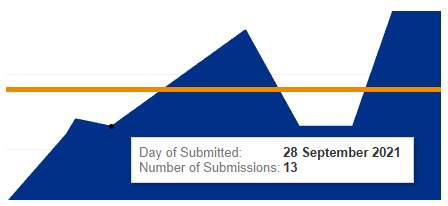
<figcaption>Figure 9 - Example of tooltip</figcaption>
 

#### Text Alignment

- Text alignment can be either side

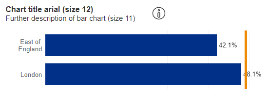
<figcaption>Figure 10 - Example of text alignment</figcaption>
 

#### Chart Dividers

Dividers between charts are an option to help separate charts\. Consider using white space

# ____7\. Maps____

Similar to charts, using maps are useful to convey information to the user\. It is important the colours and labels of these maps are effectively used to ensure the user is not confused when using the map\.

#### Map Colours

- Primary colour: Chart Blue 1 \(\#003087\)
- Secondary/Highlight colour: NHS Orange \(\#ED8B00\)
- Use the "Custom Diverging" option, selecting "Use Full Colour Range" and forcing the start, centre, and end under the "Advanced Options" to maximise the impact of the colours on the map

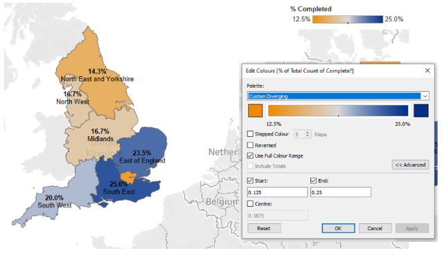
<figcaption>Figure 11 - Example map colours with settings</figcaption>
 

#### Map Labels

- Minimum font size 10
- Font type: Standard for description
- Font type: Bold for metric

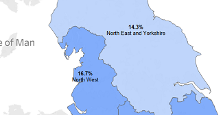
<figcaption>Figure 12 - Example Labels </figcaption>
 

#### Filters and Reset Map

- Filters to be floating objects outside the frame of the map to ensure no data is covered by the filters
- Filter headings to be Font Colour: Black and Font Type: Bold
- Reset Map button to have white text and NHS Blue \(\#005EB8\) background

  
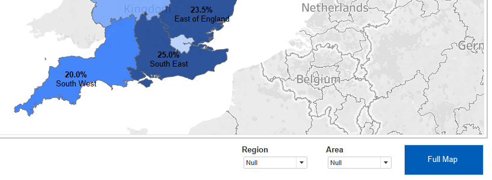
<figcaption>Figure 13 - Example of filters and reset map</figcaption>
 

# ____8\. Header Design____

The NHS Digital header is the common grounding between dashboards and is a familiar style for users when they access different dashboards across NHS Digital\.  

<figcaption>Figure 14 - Example header</figcaption>
 

#### NHS Logo

- Download from [here](https://digital.nhs.uk/about-nhs-digital/corporate-information-and-documents/nhs-digital-style-guidelines/how-we-look/our-logo)
- Left aligned
- Width 115px, Height 85px\.
- Select "Fit Image" but do not select "Centre Image"
- Outer Padding: 6 from top only
- No Inner Padding

#### Title, Description and Latest Release

- Height to match NHS Logo \(85px\)
- One text box to contain all text
- Aligned Left
- Title Size: 22, Type: Bold, Colour: Black
- Description Size: 12, Type: Standard, Grey \(\#666666\)
- Latest Release Size: 12, Type: Bold and standard, Colour Grey \(\#666666\) and Emergency Services Red \(\#DA291C\)
- No Inner or Outer Padding

#### Date Last Refreshed

- One text box to contain all text
- Aligned Right
- Title Size: 12, Type: Standard, Colour Black
- Date Size: 12, Type: Bold, Colour Black
- No Inner or Outer Padding

# ____9\. Buttons____

Buttons are a useful tool to allow users to interact with the dashboard\. Use cases include resetting filters on the page or allowing data to be downloaded\. These should be created within a horizontal container\.   
Button settings:

- Background: NHS Blue \(\#005EB8\)
- Text Size: 10, Colour: White, Font Type: Bold

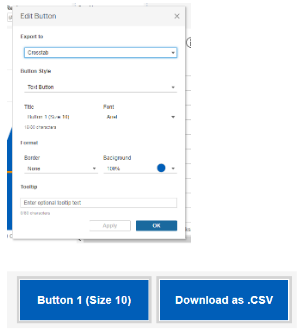
<figcaption>Figure 15 - Example Buttons</figcaption>
 
  
Horizontal container settings:

- Background: None
- Outer Padding: 6 for all
- Inner Padding: 1 for all
- Border colour: \#d4d4d4
- Border Thickness Middle option

# ____10\. Tables____

Tables are an effective way of showing the user detailed information\. It is important that the table is easy to read\.

  
Table settings:

- Table Headers: Size 10 Bold
- Table Body: Size 10
- Increase spacing between rows by 2 sizes this can be done by selecting the table and pressing CTRL SHIFT B

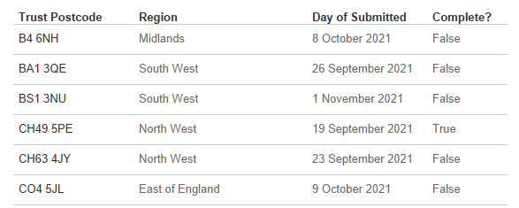
<figcaption>Figure 16 - Example of a Table</figcaption>
 

# ____11\. Filters____

Filters are used so the user can change the dashboard to their requirements\. The functionality of filters should be obvious to the user\.

  
Filter settings

- Filter title: Size 10 Bold
- Filter Body: Size 10
- Sliders must not be used for any filters as these are not easily used by those using accessibility readers

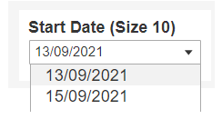
<figcaption>Figure 17 - Example of Filter</figcaption>
 

# ____12\. Icons____

__Information Icons__

Information icons can be used to provide additional information to the user when they hover or click on the information icon\.

- Download i\.png from [here\.](./files/i.png)
- Copy i\.png to the Shapes folder\. This can be found by going to File > Repository Location > Shapes\.
- Create a sheet for each icon
- Use dummy data to create an empty table
- Click the "Shape" mark, select "More Shapes", select the folder you created in previous step and select the icon
- Use Tooltip to provide the text which appears when you hover over the icon
- Note these tooltips can be used to navigate user to other sheets in the dashboard
- In the dashboard add sheet as a floating object and use the following dimensions for each use case: 
	- Charts: Width 30, Height 30
	- Date last refreshed: Width 40, Height 40

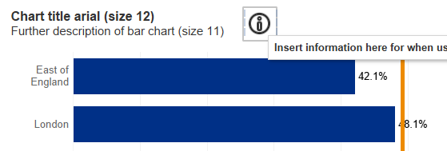
<figcaption>Figure 18 - Chart title example with icon and tooltip</figcaption>
 

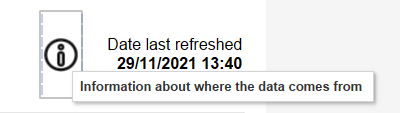
<figcaption>Figure 19 - Date Last Refreshed Icon and Tooltip</figcaption>
 

__Right Arrow and Download Icons__

The right arrow icon and download Icon can be used as above or just as an image in a dashboard\. There are two colours available, Black and Blue\. Download the \.zip file [here](./files/Icons.zip)\.

# ____13\. General Padding and Formatting of Objects____

__Note:__ the following section applies only to Tableau, the exact measurements required in other applications such as Microsoft PowerBI may not match exactly the dimensions stated below\.   
The provided templates are built upon containers which have the following dimensions\. These are important to follow as they have been calculated to ensure best readability and design of the dashboard\.

#### NHS Digital Header

For the header padding refer to Section 8: Header Design above

#### Headlines:

Headlines should be sheets or text boxes within a horizontal container   
Container settings:

- Background colour: \#f5f5f5
- Outer Padding: 15 top only
- Inner Padding: 0 for all\.

  
Sheet / Text Box Settings

- Background: White
- Height: 95px
- Outer Padding 6 for all \(make zero for one side of each headline to avoid doubling up the grey spacing\)
- Inner Padding 7 for all
- Left Aligned
- Title size: 12, Colour: \#666666, Text Type: Standard
- Headline number size: 20, Colour: NHS Blue \(\#005eb8\), Text Type: Bold
- Sub headline size: 12, Colour Black with NHS Blue \(\#005EB8\) highlight, Text Type: Standard\. Be aware using green/red together may not be suitable for those who are colour blind\.

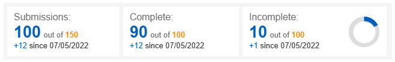

#### Filter Bar:

The filter bar is built up using a vertical container with a text box and horizontal container stacked\. The text describes what the filters do\. The bottom horizontal container includes the filters and buttons\. 

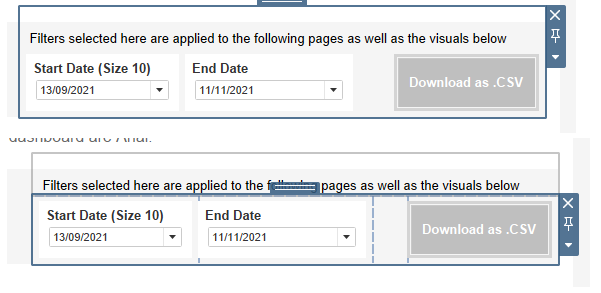

Text settings:

- Background colour: \#f5f5f5
- Height 45px
- Outer Padding: 15 top only
- Inner Padding: 7 for left and top 0 for right and bottom\.

  
Filter settings:

- Background: White
- Height 68px
- Outer Padding 6 for all \(make zero for one side of each headline to avoid doubling up the grey spacing\)
- Inner Padding 7 for all \(apart from 0 for bottom\)
- Title size: 10, Colour: Black, Text Type: Bold

  
Button settings:

- Refer to Buttons sections\.

#### Navigation Buttons:

Horizontal containers are used for the home button and navigations buttons   

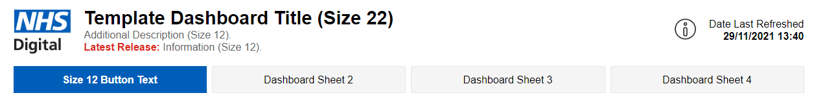

Horizontal Container settings:

- Background colour: White
- Outer Padding: 10 top only
- Inner Padding: 0 for all\.

Home button settings

- Image downloaded from [here](./files/home.png)
- Fit image, centre image
- W = 60px, H = 68px

  
Navigation button settings

- Height 58px
- White border \(largest option\)
- No inner or outer padding
- Background colour \(\#f5f5f5\) for other pages
- Background colour \(\#005eb8\) for highlight page

#### ____Charts:____

Settings:

- Background colour: White
- Outer Padding: 4 for all
- Inner Padding: 10 for top only
- Refer to Charts section for colours and font sizes

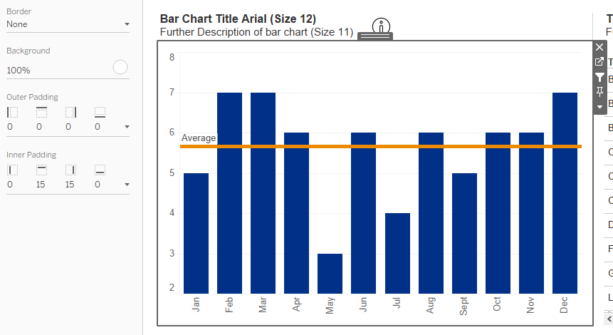

<figcaption>Figure 20 - Example Chart</figcaption>
 

#### ____Maps:____

Settings:

- Background colour: White
- Outer Padding: 4 for all
- Inner Padding: 10 for top only
- Refer to Maps section for colours and font sizes

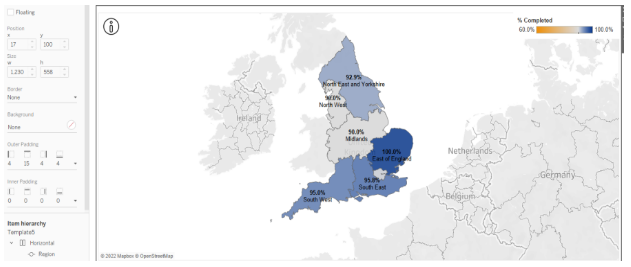
<figcaption>Figure 21 - Example Map</figcaption>
 

#### ____Text Page:____

Text on text pages should not run across the full length of the page as this can be difficult to read\. Split up the page into thirds and avoid text running across more than two thirds of the page\.

Header settings

- Font Size: 12
- Font Type: Bold
- Blank divider height 3px and colour \(\#e6e6e6\) to be used underneath headers

  
Sub headers

- Font Size: 11
- Font Type : Bold

  
Text

- Font Size: 11
- Font Type: Standard

  
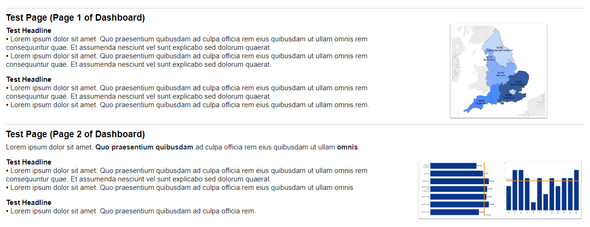

<figcaption>Figure 22 - Example text page highlighting the rule of thirds</figcaption>

# ____14\. Accessibility____

__Refer to following articles:__

- [A user centred design approach to visualising data](https://hscic365.sharepoint.com/:p:/r/sites/DataServices-BusinessIntelligence/_layouts/15/Doc.aspx?sourcedoc=%7B39F15363-EA60-4D17-A03F-56F0B09A2343%7D&file=Guidance%20for%20visualising%20data%20(UCD%20draft%20Feb%20%2721).pptx&action=edit&mobileredirect=true)
- [User\-Centred Design guidance](https://hscic365.sharepoint.com/:w:/r/sites/DataServices-BusinessIntelligence/_layouts/15/Doc.aspx?sourcedoc=%7BEBE89914-99C2-421F-A4A4-1360088D8FBC%7D&file=User-Centred%20Design%20BI%20best%20practice.docx&action=default&mobileredirect=true)
- [Tableau: Build Accessible Dashboards](https://help.tableau.com/current/pro/desktop/en-us/accessibility_dashboards.htm)
- [Tableau: Accessibility Best Practice](https://help.tableau.com/current/pro/desktop/en-us/accessibility_best_practice.htm)
- [Tableau: Accessibility Create View](https://help.tableau.com/current/pro/desktop/en-us/accessibility_create_view.htm)
- [Tableau: Accessibility FAQ](https://community.tableau.com/s/question/0D54T00000C6nsjSAB/faq-accessibility?_ga=2.161204285.1249274555.1614287510-167303938.1594327031)
- [NHS Service Manual \(Broad Perspective\)](https://service-manual.nhs.uk/)

  
__Key takeaways__

- Keep charts simple and ensure they are clearly annotated
- Sliders cannot be interacted with easily without a mouse use drop downs instead\.
- Keep text fonts black or dark grey\. Do not use light colours

  

# ____15\. What Chart Should Be Used When?____

Different charts can convey information in different ways, the ONS provide guidance on when best to use each common chart type here: [https://style\.ons\.gov\.uk/category/data\-visualisation/chart](https://style.ons.gov.uk/category/data-visualisation/chart-type/)

NHS Digital Chart Type Guide here:  
[https://digital\.nhs\.uk/about\-nhs\-digital/corporate\-information\-and\-documents/nhs\-digital\-style\-guidelines/how\-we\-look/charts\#choosing\-the\-right\-chart\-type!](https://digital.nhs.uk/about-nhs-digital/corporate-information-and-documents/nhs-digital-style-guidelines/how-we-look/charts#choosing-the-right-chart-type)

Below are examples of good practice designs:

#### ____Bar Charts:____

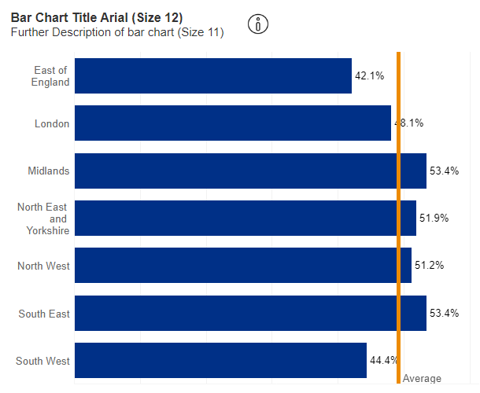

#### ____Gauge / Donut Charts:____

Generally pie charts are not recommended, but used as the donut charts below can be very effective to give key information to the user\. In this case, they work well working as a gauge showing progression from 0 to 100%\.  

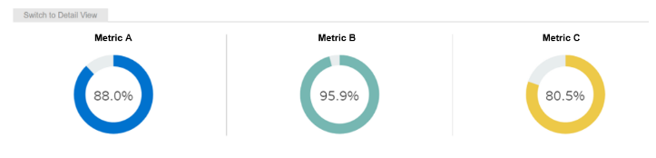

#### ____Line Charts:____

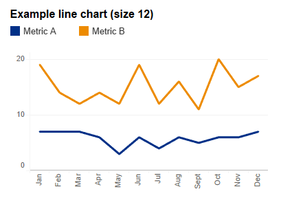

#### ____Tables:____

Where detail is required that a visualisation cannot provide tables can be used effectively\. It also gives the user the option to download data\.   

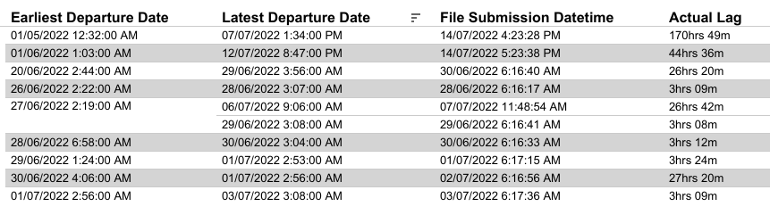
