# __Dashboard Template Guidance Document__

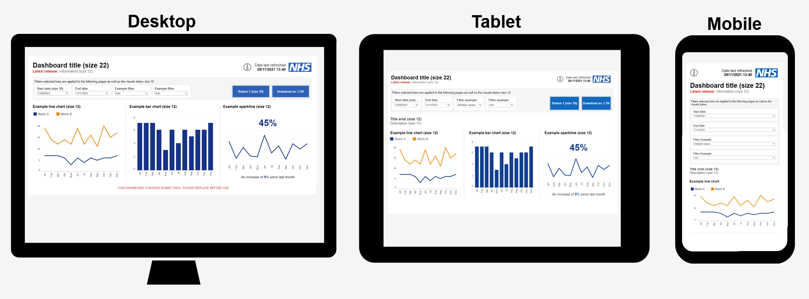

[__1\. Introduction__ ](#1-introduction)  
[__2\. Desktop scaling issues \(Tableau Desktop only\)__ ](#2-desktop-scaling-issues-tableau-desktop-only)  
[__3\. How to use templates \(Tableau Desktop only\)__](#3-how-to-use-templates-tableau-desktop-only) 
[__4\. Text formatting__](#4-text-formatting) 
[__5\. Dashboard sizing__](#5-dashboard-sizing) 
[__6\. Charts__](#6-charts) 
[__7\. Maps__](#7-maps) 
[__8\. Header design__](#8-header-design) 
[__9\. Buttons__](#9-buttons) 
[__10\. Tables__](#10-tables) 
[__11\. Filters__](#11-filters) 
[__12\. Icons__](#12-icons) 
[__13\. General padding and formatting of objects__](#13-general-padding-and-formatting-of-objects) 
[__14\. Accessibility__](#14-accessibility) 
[__15\. What chart should be used when?__](#15-what-chart-should-be-used-when) 
[__16\. Summary key links__](#16-summary-key-links) 

# ____1\. Introduction____
The purpose of this document is to provide supporting guidance for the style and formatting of NHS England dashboards plus to provide links to a set of template Tableau workbooks which have been created in line with the guidance provided\. The aim of these templates is to save development time per dashboard, share good practice and increase consistency of look and feel across NHS England dashboards\. Although this guide is written with examples from Tableau, most of all these ideas and principles can be used on other visualisation software including Microsoft PowerBI\. 

[Click here to view a demo of these dashboards](https://public.dashboards.data.digital.nhs.uk/#/views/NHSE_Templates_Complete/1_NavButtons)\.

# ____2\. Desktop scaling issues \(Tableau Desktop only\)____

To ensure the dimensions in this guidance document are accurately reflected in Tableau Desktop you must make sure your default screen is set to 100% scale\.   
When Tableau Desktop is opened it uses 1:1 sizing which means if the system scaling is at 100% then any visualisation in Tableau Desktop will be accurately reflected in Tableau Server when the workbook is published\. If the system scaling is not 100% then there can be visual discrepancies between both\.   
Here are the instructions to ensure your Tableau Desktop is scaling correctly:

1. Right click your desktop and click Display Settings
2. Select your main display
3. Scroll down to Scale and Layout and change this to 100%
4. If your previous scale was higher than 100% then everything will look a lot smaller\.
5. Open up the Tableau Workbook
6. Once this is open you can change your scaling to the previous sizing during this work session\. If you need to reopen a workbook repeat the above steps

 

# ____3\. How to use templates \(Tableau Desktop only\)____

Ensure you have read section 2 above before commencing and familiarise yourselves with the populated templates either [online](https://public.dashboards.data.digital.nhs.uk/#/views/NHSE_Templates_Complete/1_NavButtons) or [download here](./files/NHSE_Templates_Complete_v16.twbx)\.

## __Downloading and using templates for use on Tableau Server__

Download the blank templates from [here](./files/NHSE_Templates_Empty_v16.twbx) and follow either Option 1 or Option 2 depending on your use case\. Note these templates include phone and tablet views which can be turned on or off depending on requirements. If these views are turned on the dashboard will open in phone and tablet friendly views for users and can also be opened via the [Tableau App](https://www.tableau.com/en-gb/products/mobile). 

__Option 1__ \- recommended if starting a new dashboard

- Replace the dummy data source with new data source
- Update the i1,i2 and i3 worksheets by 
	- Replacing the SUM\(A\) in the Rows with another arbitrary measure\.
	- Right clicking on this measure and change to "Discrete"
	- Ensuring you hide the headers
	- Remember to update the tooltip with relevant text and duplicate the information icons for any additional tooltips on the pages\.
	- Note if the "I"s don't appear correctly head to Section 12: Information Icons
- Add own visuals to dashboards in place of the dummy placeholders
- Check tablet and phone views before publishing to server

  
__Option 2__ \- recommended if building on existing dashboard

- Copy and paste individual tabs from the template into your existing dashboard and use this to help update your existing dashboard
- Check tablet and phone views before publishing to server

## __Downloading and using templates for use within NHS England webpages (Desktop, Tablet, Phone and App)__

To use these templates within the NHS England webpages, follow Option 1 or Option 2 above and do the following:

- Reduce the width of each page from 1262px to 1220px (to ensure dashboard is not cropped due to the website margins)
- Reduce the Outer Padding and Inner Padding of the entire page container to 0.
- Check tablet and phone views before publishing to server
- Generate a "Share" link from server and paste this into the Tableau Specific NHS England Webpage Module.
- Choose how you would like the dashboard to appear (desktop only, tablet only, phone only, auto choose between all 3 or auto choose between desktop and phone only)
  
Contact David Hardy \([David\.Hardy5@nhs\.net](mailto:David.Hardy5@nhs.net)\) for any further advice

## __Custom colour palettes__

Having the NHS England default colours for charts can save time and this can be achieved by having the colour palette installed in 'My Tableau Repository' on your system:

- Download this custom "Preferences\.tps" from [here](./files/Preferences.tps)\.
- Replace your "Preferences\.tps" file in your 'My Tableau Repository' which can be found by clicking File > Repository Location
- A number of NHS England specific colour palettes should now appear when using a discrete dimension (e.g regions)

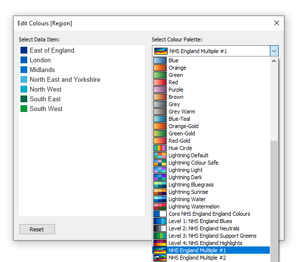

## __Custom colours__

This method shows how to save colours used often in the dashboard to avoid having to add the hex code each time

- Select any object on a dashboard or sheet
- Select something to colour such as the background
- Head to more colours
- Select a blank box in the custom colours and paste in the following key colours
- NHS Blue \(\#005EB8\)
- Chart Blue 1 \(\#003087\)
- Secondary/Highlight colour: NHS Orange \(\#ED8B00\)
- Emergency Services Red \(\#DA291C\)
- Background Colour behind filters and other objects: Grey \(\#f5f5f5\)

 

# ____4\. Text formatting____

Text formatting across the dashboard should be consistent\. Smaller font sizes can cause accessibility issues\. The standard font used is Arial and a variety of sizes are used depending on the feature of the dashboard\. 

Note titles and headings should only have the first letter capitalised. 

## __Text styling__

- Font: Arial
- Headings: Size: 12pt , Type: Bold, Colour: Black
- Headings Description, Size 11pt, Type: Standard, Colour: Black
- Sub Headings: Size: 11pt, Type: Bold, Colour: Black
- General Text, Size: 11pt, Type: Standard, Colour: Black
- Tables Headings, Size 10pt, Type Bold, Colour: Black
- Tables, Size 10pt, Type Standard, Colour: Black

<figcaption>Heading, sub heading and general text example</figcaption>
 

## __Text colours__

- Primary colour: Black
- Secondary colour: Grey \(\#666666\)
- Highlight colour: Emergency Services Red \(\#DA291C\)

Be aware using green/red together as these are not suitable for those who are colour blind\. See [NHS guidance](https://www.england.nhs.uk/nhsidentity/identity-guidelines/colours/) for more information on colours\.   

<figcaption>Header example using Primary, Secondary and Highlight Colours</figcaption>
 

# ____5\. Dashboard sizing____

Dashboard sizing is important to ensure all users see the same layout of the dashboard as designed\.

## __Page width and height for for use on Tableau Server__

- Use "Fixed Size" to ensure page looks the same across all devices\. This also has performance benefits vs "Automatic"\.
- Width fixed to 1,262px, this allows users of the majority of popular screen sizes to see the full width of a dashboard without horizontal scrolling
- Height is variable depending on your dashboard templates provided have a standard height of 1400px\. Note when you adjust the height the height of objects on the page may change so you will need to update these manually afterwards\.

  

<figcaption>Screenshot of page width settings</figcaption>
 

## __Page width and height for use within NHS England webpages (Desktop, Tablet, Phone and App)__

- Use "Fixed Size" on the Default view to ensure page looks the same across all devices\. This also has performance benefits vs "Automatic"\.
- Width fixed to 1,220px, this allows users of the majority of popular screen sizes to see the full width of a dashboard without horizontal scrolling and accounts for the padding used on NHS England webpages
- Use "Fit Width" on the Phone and Tablet views
- Height is variable depending on your dashboard templates provided have a standard height of 1400px\. Note when you adjust the height the height of objects on the page may change so you will need to update these manually afterwards\.

# ____6\. Charts____

Charts are often used in dashboards to convey information to the user, it is important the colours are consistent across the dashboard as to not confuse the user\.

## __Chart colours__

- Primary colour: Chart Blue 1 \(\#003087\)
- Secondary/Highlight colour: NHS Orange \(\#ED8B00\)
- Background Colour behind filters and other objects: Grey \(\#f5f5f5\)
- Tertiary\+ Colours: Choose from [NHS Guidance](https://www.england.nhs.uk/nhsidentity/identity-guidelines/colours/)

  

<figcaption>Example charts with primary colour and highlight colour</figcaption>
 
 
  

<figcaption>Example charts with additional colours</figcaption>
 
 

  
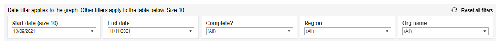
<figcaption>Example of the background grey behind filters</figcaption>
 

## __Chart tooltips__

Tooltips provide additional information to the user when they highlight areas of a chart

- Tooltips for charts should be Font Size: 10
- Descriptions colour: \#787878 Font Type: Standard
- Metrics Colour: Black and Font Type: Bold

<figcaption>Example of tooltip</figcaption>
 

## __Text alignment__

- Text alignment can be either side

<figcaption>Example of text alignment</figcaption>
 

## __Chart dividers__

Dividers between charts are used to help separate charts\. Consider using white space
- 1px wide 
- Colour: #d4d4d4
- Use horizontal container to create dividers
	- Outer padding 6 left, 6 right and 15 top
	- Background colour: #d4d4d4
- Within horizontal container use nested containers
	- Outer padding 1px left (on right container)
- Do not use "floating" lines to create dividers

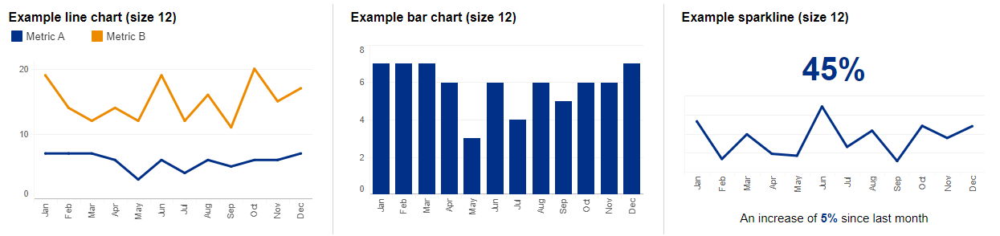
<figcaption>Example of text alignment</figcaption>
 

# ____7\. Maps____

Similar to charts, using maps are useful to convey information to the user\. It is important the colours and labels of these maps are effectively used to ensure the user is not confused when using the map\.

## __Map colours__
- Download the custom colour palette from Section 3 above
- Use the "NHS England Maps Colour Palette Diverging" option, selecting "Stepped Colour", "Use Full Colour Range" and forcing the start, centre, and end under the "Advanced Options" to maximise the impact of the colours on the map

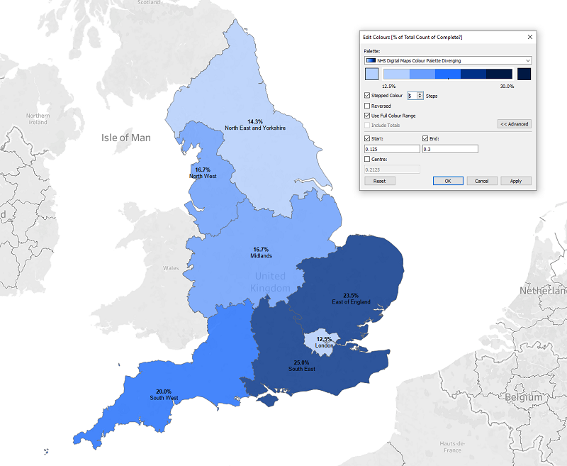
<figcaption>Example map colours with settings</figcaption>
 

## __Map labels__

- Minimum font size 10
- Font type: Standard for description
- Font type: Bold for metric

<figcaption>Example Labels </figcaption>
 

## __Filters and full map__

- Filters to be floating objects outside the frame of the map to ensure no data is covered by the filters
- Filter headings to be Font Colour: Black and Font Type: Bold
- Full Map button to have white text and NHS Blue \(\#005EB8\) background

  

<figcaption>Example of filters and reset map</figcaption>
 

# ____8\. Header design____

The NHS England header is the common grounding between dashboards and is a familiar style for users when they access different dashboards across NHS England\.  

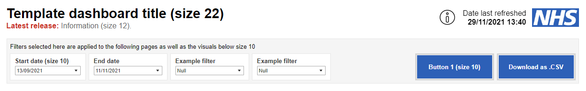
<figcaption>Example header</figcaption>
 

## __NHS logo__

- Download from [here](https://www.england.nhs.uk/nhsidentity/identity-guidelines/nhs-logo/)
- Outer Padding: 6 from left and right
- Width 112px, Height 60px (entire horizontal container)\.
- Select "Fit Image" but do not select "Centre Image"
- No Inner Padding

## __Title, description and latest release__

- Height to match NHS Logo \(60px\)
- One text box to contain all text
- Aligned Left
- Title Size: 22, Type: Bold, Colour: Black
- Description Size: 12, Type: Standard, Grey \(\#666666\)
- Latest Release Size: 12, Type: Bold and standard, Colour Grey \(\#666666\) and Emergency Services Red \(\#DA291C\)
- No Inner or Outer Padding

## __Date last refreshed__

- One text box to contain all text
- Aligned Right
- Title Size: 12, Type: Standard, Colour Black
- Date Size: 12, Type: Bold, Colour Black
- No Inner Padding
- 6px Outer Padding

# ____9\. Buttons____

Buttons are a useful tool to allow users to interact with the dashboard\. Use cases include resetting filters on the page or allowing data to be downloaded\. These should be created within a horizontal container\.   
Button settings:

- Background: NHS Blue \(\#005EB8\)
- Text Size: 10, Colour: White, Font Type: Bold

<figcaption>Example Buttons</figcaption>
 
  
Horizontal container settings:

- Background: None
- Outer Padding: 6 for all
- Inner Padding: 1 for all
- Border colour: \#d4d4d4
- Border Thickness Middle option

# ____10\. Tables____

Tables are an effective way of showing the user detailed information\. It is important that the table is easy to read\.

  
Table settings:

- Table Headers: Size 10 Bold
- Table Body: Size 10
- Increase spacing between rows by 2 sizes this can be done by selecting the table and pressing CTRL SHIFT B

<figcaption>Example of a Table</figcaption>
 

# ____11\. Filters____

Filters are used so the user can change the dashboard to their requirements\. The functionality of filters should be obvious to the user\.

  
Filter settings

- Filter title: Size 10 Bold
- Filter Body: Size 10
- Sliders must not be used for any filters as these are not easily used by those using accessibility readers
- Reset filter icon and text (if appropriate) should be in the top right of the filter box. 

<figcaption>Example of Filter</figcaption>
 

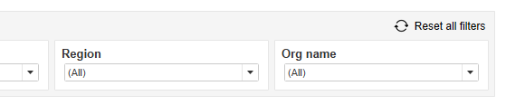
<figcaption>Example of reset</figcaption>
 

# ____12\. Icons____

## __Information icons__

Information icons can be used to provide additional information to the user when they hover or click on the information icon\.

- Download i\.png from [here\.](./files/Icons.zip)
- Copy i\.png to the Shapes folder\. This can be found by going to File > Repository Location > Shapes\.
- Create a sheet for each icon
- Use dummy data to create an empty table
- Click the "Shape" mark, select "More Shapes", select the folder you created in previous step and select the icon
- Use Tooltip to provide the text which appears when you hover over the icon
- Note these tooltips can be used to navigate user to other sheets in the dashboard
- In the dashboard add sheet into the relevant container and use the following dimensions for each use case: 
	- Charts: Width 40, Height 40
	- Date last refreshed: Width 40, Height 40

<figcaption>Chart title example with icon and tooltip</figcaption>
 

<figcaption>Date Last Refreshed Icon and Tooltip</figcaption>
 

## __Right Arrow and download icons__

The right arrow icon and download Icon can be used as above or just as an image in a dashboard\. There are two colours available, Black and Blue\. Download the \.zip file [here](./files/Icons.zip)\.

# ____13\. General padding and formatting of objects____

__Note:__ the following section applies only to Tableau, the exact measurements required in other applications such as Microsoft PowerBI may not match exactly the dimensions stated below\.   
The provided templates are built upon containers which have the following dimensions\. These are important to follow as they have been calculated to ensure best readability and design of the dashboard\.

## __NHS England header__

For the header padding refer to Section 8: Header Design above

## __Headlines:__

Headlines should be sheets or text boxes within a horizontal container   

__Container settings:__

- Background colour: \#f5f5f5
- Border colour: #e6e6e6
- Border thickness: Smallest option
- Outer Padding: 0 for all
- Inner Padding: 0 for all\.

  
__Sheet / Text box settings__

- Background: White
- Border colour: #e6e6e6
- Border thickness: Smallest option
- Height: 95px
- Outer Padding 6 for all \(make zero for one side of each headline to avoid doubling up the grey spacing\)
- Inner Padding 7 for all
- Left Aligned
- Title size: 12, Colour: Black, Text Type: Standard
- Headline number size: 20, Colour: NHS Blue \(\#005eb8\), Text Type: Bold
- Sub headline size: 12, Colour Black with NHS Blue \(\#005EB8\) highlight, Text Type: Standard\. Be aware using green/red together may not be suitable for those who are colour blind\.

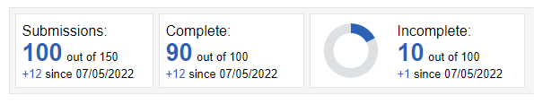

## __Filter bar:__

The filter bar is built up using a vertical container with a text box and horizontal container stacked\. The text describes what the filters do\. The bottom horizontal container includes the filters and buttons\. 

__Vertical container settings:__
- Height 116px
- Background colour: \#f5f5f5
- Outer Padding: 6 left, 15 top, 6 right, 6 bottom
- Inner Padding: 0
- Border colour: #e6e6e6
- Border thickness: Smallest option

__Text settings:__
- Height 25px
- Outer Padding: 0 for all
- Inner Padding: 7 for left and top. 0 for right and bottom\.
  
__Filter settings:__
- Background: White
- Border colour: #e6e6e6
- Border thickness: Smallest option
- Height 68px
- Outer Padding 6 for all \(make zero for one side of each headline to avoid doubling up the grey spacing\)
- Inner Padding 7 for all \(apart from 0 for bottom\)
- Title size: 10, Colour: Black, Text Type: Bold

  
## __Button settings:__

- Refer to Buttons sections\.

## __Navigation buttons:__

Horizontal containers are used for the navigations buttons   

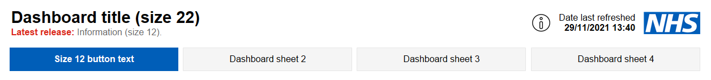

__Horizontal container settings:__

- Background colour: White
- Outer Padding: 10 top, 2 left, 2 right and 0 bottom
- Inner Padding: 0 for all\.

__Navigation button settings__

- Height 50px
- Outer padding: 4 for all
- Other Pages 
	- Background colour \(\#f5f5f5\)
	- Border colour: #e6e6e6
	- Border thickness: Smallest option
- Highlight Page
	- Background colour \(\#005eb8\)
	- No border

## ____Charts:____

__Settings:__
- Ensure there is 6px of padding from the left and 15px of padding from the element above it
	-  This can be built up either within the chart or the container it sits in
- Background colour: White
- Refer to Charts section for colours and font sizes

<figcaption>Example chart</figcaption>
 

## ____Maps:____

__Settings:__

- Background colour: White
- Outer Padding: 6 left, 15 top, 6 right, 6 bottom
- No inner padding
- Refer to Maps section for colours and font sizes

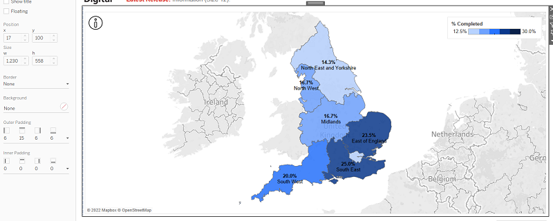
<figcaption>Example Map</figcaption>
 

#### ____Text page:____

Text on text pages should not run across the full length of the page as this can be difficult to read\. Split up the page into thirds and avoid text running across more than two thirds of the page\.

__Header settings__
- Create horizontal container 
	- Container background colour: #d4d4d4
- Place text boxes in vertical containers
- Outerpadding of text box to be 1px from top (this creates the divider)
- Font Size: 12
- Font Type: Bold
  
__Sub headers__

- Font Size: 11
- Font Type : Bold

  
__Text__

- Font Size: 11
- Font Type: Standard

  
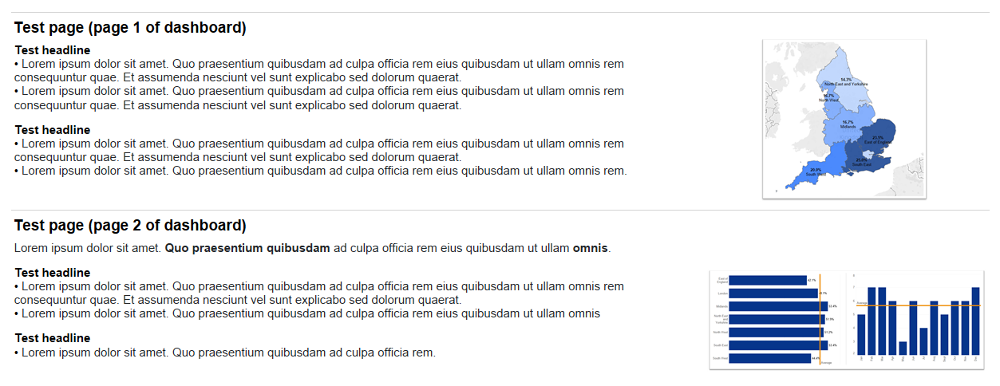

# ____14\. Accessibility____

__Refer to following articles:__

- [A user centred design approach to visualising data](https://hscic365.sharepoint.com/:p:/r/sites/DataServices-BusinessIntelligence/_layouts/15/Doc.aspx?sourcedoc=%7B39F15363-EA60-4D17-A03F-56F0B09A2343%7D&file=Guidance%20for%20visualising%20data%20(UCD%20draft%20Feb%20%2721).pptx&action=edit&mobileredirect=true)
- [User\-Centred Design guidance](https://hscic365.sharepoint.com/:w:/r/sites/DataServices-BusinessIntelligence/_layouts/15/Doc.aspx?sourcedoc=%7BEBE89914-99C2-421F-A4A4-1360088D8FBC%7D&file=User-Centred%20Design%20BI%20best%20practice.docx&action=default&mobileredirect=true)
- [Tableau: Build Accessible Dashboards](https://help.tableau.com/current/pro/desktop/en-us/accessibility_dashboards.htm)
- [Tableau: Accessibility Best Practice](https://help.tableau.com/current/pro/desktop/en-us/accessibility_best_practice.htm)
- [Tableau: Accessibility Create View](https://help.tableau.com/current/pro/desktop/en-us/accessibility_create_view.htm)
- [Tableau: Accessibility FAQ](https://community.tableau.com/s/question/0D54T00000C6nsjSAB/faq-accessibility?_ga=2.161204285.1249274555.1614287510-167303938.1594327031)
- [NHS Service Manual \(Broad Perspective\)](https://service-manual.nhs.uk/)

  
__Key takeaways__

- Keep charts simple and ensure they are clearly annotated
- Sliders cannot be interacted with easily without a mouse use drop downs instead\.
- Keep text fonts black or dark grey\. Do not use light colours

  

# ____15\. What chart should be used when?____

Different charts can convey information in different ways, the ONS provide guidance on when best to use each common chart type here: [https://style\.ons\.gov\.uk/category/data\-visualisation/chart](https://style.ons.gov.uk/category/data-visualisation/chart-type/)

NHS England Chart Type Guide here:  
[https://digital\.nhs\.uk/about\-nhs\-digital/corporate\-information\-and\-documents/nhs\-digital\-style\-guidelines/how\-we\-look/charts\#choosing\-the\-right\-chart\-type!](https://digital.nhs.uk/about-nhs-digital/corporate-information-and-documents/nhs-digital-style-guidelines/how-we-look/charts#choosing-the-right-chart-type)

Below are examples of good practice designs:

## ____Bar charts:____

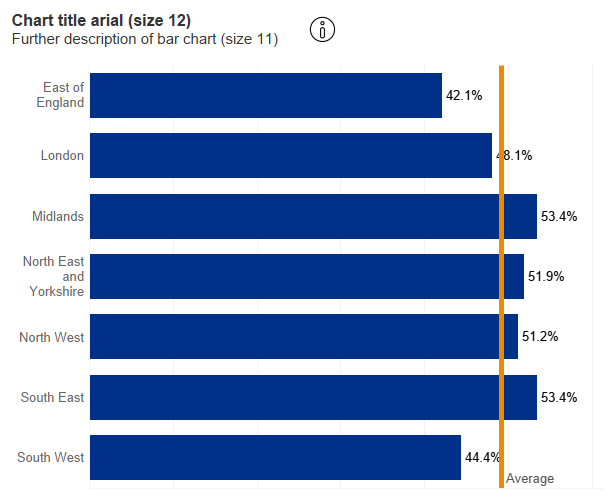

## ____Gauge / donut charts:____

Generally pie charts are not recommended, but used as the donut charts below can be very effective to give key information to the user\. In this case, they work well working as a gauge showing progression from 0 to 100%\.  

## ____Line charts:____

## ____Tables:____

Where detail is required that a visualisation cannot provide tables can be used effectively\. It also gives the user the option to download data\.   

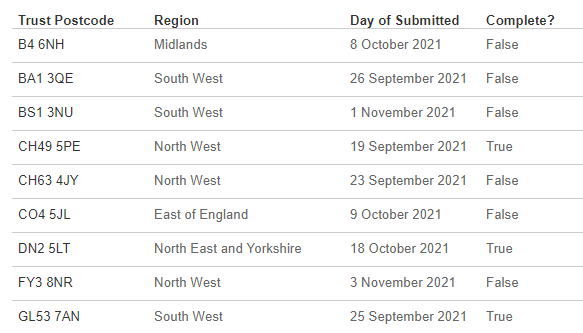

# ____16\. Summary key links____

- [Online Demo of Templates](https://public.dashboards.data.digital.nhs.uk/#/views/NHSE_Templates_Complete/1_NavButtons)
- [Populated Template Download](./files/NHSE_Templates_Complete_v16.twbx)
- [Empty Template Download](./files/NHSE_Templates_Empty_v16.twbx)
- [Custom Colour Palette "Preferences.tps" file](./files/Preferences.tps)
- [Icons](./files/Icons.zip)
- [NHS England Logo](https://www.england.nhs.uk/nhsidentity/identity-guidelines/nhs-logo/)
- [Style Guidance](https://digital.nhs.uk/about-nhs-digital/corporate-information-and-documents/nhs-digital-style-guidelines)